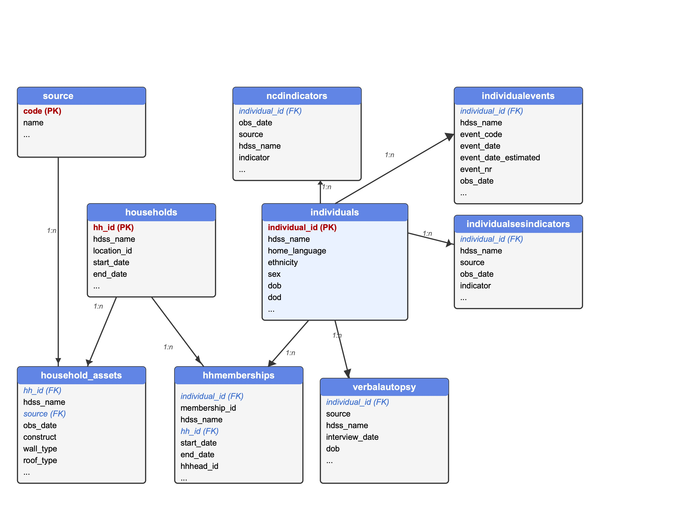

# MADIVA Data Sharing Information

## Available Data

We have two different datasets:
1. From the Nairobi HDSS that is managed by the African Population and Health Research Centre.
2. From the Agincourt Health HDSS managed by the SAMRC/Wits Rural Public Health and Health Transition Research Unit.

Description of the sites can be found here:
- [Beguy et al. _Health & Demographic Surveillance System Profile: The Nairobi Urban Health and Demographic Surveillance System (NUHDSS)_](https://academic.oup.com/ije/article-abstract/44/2/462/752904)
- [Kahn et al. _Profile: Agincourt Health Socio-demographic Surveillance System_](https://academic.oup.com/ije/article/41/4/988/690287)

## Principles and ethics of data Sharing

The [MADIVA Data Sharing Policy](docs/madiva_data_sharing_301.pdf) balances three principles:
- Protecting research participants. This is our priority. We need to work within the constraints of our ethics approval, consent given by participants and the South African and Kenyan legislation:
- Our support for open science. We believe our data will be of benefit to many people.
- MADIVA is a secondary data project. We want to give the primary providers a limited period of exclusive access.

## Key Data Captured

The key data objects modelled in the MADIVA data are:

- **Individuals**: These are the individuals in the HDSS whose data we have. The individuals table records basic individual-level data: a unique code, a year of birth and death (which may be off by 1).

- **Household**: A household is logical conceptual unit - a number of individuals live in a household. Typically a household maps to one physical house but in some cases may physically move. Which individuals live in a household may change over time.

The other tables capture information about and relate the individuals and households. The major tables are listed above.

- **ncd_indicators**: This is the largest table and the core of our database. Each row records a health data point about one individual. A row contains details of the person, what type of health data is being collected, the value of that data, when the data was collected and what the provenance of the data.

- **ses_indicators**: Similar to above but including socio-economic data.

- **hh_memberships**: Records which for each person when they belonged to which households.

- **verbal_autopsy**: For a subset of the individuals.

There are also some small auxiliary tables that describe the data sources and the ncd indicators. A simplified entity-relationship diagram is shown below:

